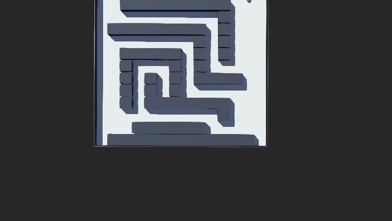
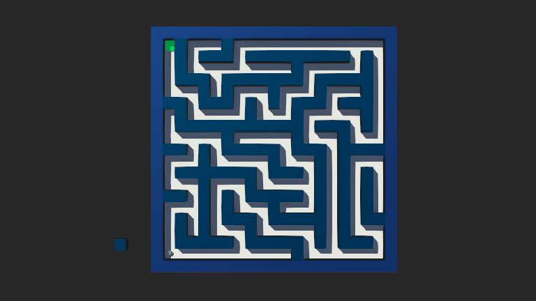
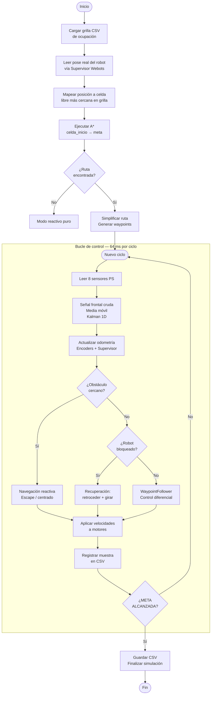

# Proyecto Final — Navegación Autónoma con Planificación de Rutas en Webots

**Asignatura:** Robótica y Sistemas Autónomos (ICI 4150) — PUCV 2026-01  
**Docente:** Sandra Cano — sandra.cano@pucv.cl

## Integrantes

| Nombre |
|--------|
| Pablo Aguilera |
| Benjamin Gomez |
| Cristian Mejias |
| Cristobal Rubilar |
| Joaquin Garrido |

---

## Línea seleccionada

**Línea A — Planificación de rutas con A\*** sobre grilla de ocupación 2D, complementada con navegación reactiva como capa de seguridad ante obstáculos imprevistos.

---

## Objetivo del proyecto

Diseñar, implementar y evaluar en Webots un sistema de navegación autónoma para el robot diferencial e-puck, capaz de:

- Planificar una ruta óptima desde su posición actual hasta una meta usando el algoritmo A\*.
- Ejecutar dicha ruta mediante control cinemático diferencial y seguimiento de waypoints.
- Evitar colisiones en tiempo real con una capa de navegación reactiva basada en sensores de proximidad.
- Estimar su posición mediante odometría diferencial fusionada con el supervisor de Webots.
- Registrar y analizar métricas de desempeño en dos escenarios de distinta complejidad.

---

## Descripción del robot, sensores y actuadores

### Robot

El robot utilizado es el **e-puck** de Webots, un robot diferencial de dos ruedas con las siguientes características físicas relevantes:

| Parámetro | Valor |
|-----------|-------|
| Radio de rueda | 0.0205 m |
| Distancia entre ruedas | 0.052 m |
| Velocidad máxima de motor | 6.28 rad/s |
| Paso de tiempo de simulación | 64 ms |

### Sensores de proximidad (PS)

El e-puck cuenta con 8 sensores de proximidad infrarrojos (`ps0`–`ps7`) distribuidos alrededor del cuerpo. Los utilizados son:

| Índice | Posición | Uso en el sistema |
|--------|----------|-------------------|
| `ps0` | Frontal derecho | Detección de obstáculos frontales |
| `ps7` | Frontal izquierdo | Detección de obstáculos frontales |
| `ps2` | Lateral derecho | Navegación reactiva lateral |
| `ps5` | Lateral izquierdo | Navegación reactiva lateral |

Los sensores devuelven valores más altos cuando el obstáculo está más cerca. El umbral de intervención frontal está configurado en **105.0** y el lateral en **150.0**.

### Encoders (actuadores con retroalimentación)

Los dos motores (`left wheel motor`, `right wheel motor`) exponen encoders de posición angular. Se leen en cada ciclo de 64 ms para calcular odometría diferencial.

### Supervisor Webots

Se utiliza la API `Supervisor` de Webots para leer la posición y orientación real del robot en cada paso. Esto permite corregir la pose odométrica y garantizar que el A\* se planifique siempre desde la posición real del robot, independientemente de dónde se coloque en el mapa.

---

## Descripción de los escenarios de prueba

### Escenario simple — `maze_simple.wbt`



- **Grilla:** 14 × 14 celdas (0.2 m/celda → 2.8 m × 2.8 m)
- **Inicio:** esquina inferior izquierda (celda 12, 1)
- **Meta:** esquina superior derecha (celda 1, 12)
- **Descripción:** laberinto con pasillos alineados a la grilla, sin zonas de bloqueo. Diseñado para validar el funcionamiento básico del sistema.

### Escenario complejo — `maze_complex2.wbt`



- **Grilla:** 21 × 21 celdas (0.2 m/celda → 4.2 m × 4.2 m)
- **Inicio:** esquina inferior izquierda (celda 20, 2)
- **Meta:** esquina superior derecha (celda 2, 20)
- **Descripción:** laberinto en espiral con más niveles de anidamiento, pasillos estrechos y mayor longitud de ruta. Diseñado para demostrar la robustez del sistema en condiciones más exigentes.

La grilla de cada escenario se representa en archivos CSV dentro de `maps/`, con la codificación:

| Valor | Significado |
|-------|-------------|
| `0` | Celda libre |
| `1` | Obstáculo |
| `2` | Posición de inicio por defecto |
| `3` | Meta |

---

## Arquitectura del sistema

El sistema está dividido en módulos independientes dentro de `controllers/final_controller/`:

```
final_controller.py      ← Controlador principal (bucle Webots)
├── astar.py             ← Algoritmo A* con heurística Manhattan
├── occupancy_grid.py    ← Grilla de ocupación y conversión de coordenadas
├── waypoint_follower.py ← Seguimiento de waypoints con control diferencial
├── reactive_navigation.py ← Capa reactiva de evasión de obstáculos
├── odometry.py          ← Odometría diferencial con encoders
├── filters.py           ← Filtro de media móvil y Filtro de Kalman 1D
├── sensors.py           ← Lectura e indexado de sensores PS
├── differential_drive.py ← Inicialización de motores y encoders
├── metrics_logger.py    ← Registro CSV de métricas por muestra
└── config.py            ← Parámetros globales del sistema
```

El controlador actúa en dos fases:

1. **Inicialización:** carga la grilla, lee la pose real del robot, ejecuta A\* y genera la lista de waypoints.
2. **Bucle de control (64 ms/ciclo):** lee sensores, actualiza odometría, decide acción (reactiva / recuperación / waypoint) y aplica velocidades.

---

## Explicación del algoritmo implementado

### Navegación global: A\* sobre grilla de ocupación

El algoritmo A\* busca la ruta de menor costo desde la celda de inicio hasta la celda meta. Se implementa en `astar.py` con las siguientes características:

- **Movimiento:** 4 direcciones (arriba, abajo, izquierda, derecha). Cada paso tiene costo 1.
- **Heurística:** distancia Manhattan — `h(n) = |fila_n - fila_meta| + |col_n - col_meta|`. Admisible y consistente para movimiento 4-direccional.
- **Función de evaluación:** `f(n) = g(n) + h(n)`, donde `g(n)` es el costo acumulado real.
- **Estructura de frontera:** min-heap (`heapq`) con desempate por contador de inserción.
- **Reconstrucción:** diccionario `came_from` que permite trazar la ruta completa al llegar a la meta.

#### Pseudocódigo A\*

```
función A*(grilla, inicio, meta):
    frontera  ← min-heap con (f=0, inicio)
    costo_g[inicio] ← 0
    came_from ← {}

    mientras frontera no esté vacía:
        actual ← extraer nodo con menor f de frontera

        si actual == meta:
            retornar reconstruir_ruta(came_from, inicio, meta)

        para cada vecino libre en 4-vecinos(actual):
            nuevo_g ← costo_g[actual] + 1
            si nuevo_g < costo_g.get(vecino, ∞):
                costo_g[vecino] ← nuevo_g
                f ← nuevo_g + Manhattan(vecino, meta)
                insertar (f, vecino) en frontera
                came_from[vecino] ← actual

    retornar []   ← sin ruta disponible
```

#### Generación de waypoints

La ruta de celdas se simplifica eliminando puntos intermedios en tramos rectos (`simplificar_ruta`), reduciendo el número de waypoints a seguir. Cada celda restante se convierte a coordenadas reales Webots mediante:

```
x_mundo = origen_x + columna × tamaño_celda
y_mundo = origen_y − fila × tamaño_celda
```

### Seguimiento de waypoints

`WaypointFollower` implementa un controlador proporcional que calcula el error angular entre la orientación actual del robot y la dirección al waypoint objetivo:

- Si el error angular supera **0.35 rad**, el robot gira en el lugar antes de avanzar (`GIRAR_A_WAYPOINT`).
- La velocidad lineal nominal es **0.045 m/s** con ganancia angular de **3.2**.
- Un waypoint se considera alcanzado cuando la distancia al mismo es inferior a **0.08 m**.
- Al llegar al último waypoint se emite `META_ALCANZADA` y el robot se detiene.

### Navegación reactiva (capa de seguridad)

`NavegacionReactiva` tiene prioridad sobre el seguidor de waypoints. Se activa cuando:

- La señal frontal (filtrada/Kalman) supera el umbral **105.0**.
- Algún sensor lateral supera el umbral extremo **350.0**.

Comportamiento en cascada:
1. **Escape:** gira en arco hacia el lado con menor obstáculo durante 40 ciclos.
2. **Salida de escape:** avanza recto 10 ciclos para despegarse del obstáculo.
3. **Centrado en pasillo:** si hay obstáculos laterales moderados, aplica corrección proporcional para mantener el robot centrado en el pasillo.

### Recuperación ante bloqueo

Si el robot intenta avanzar (velocidades de rueda positivas) pero la odometría no registra movimiento por **35 ciclos consecutivos**, se activa la secuencia de recuperación:

1. Retrocede durante 18 ciclos a −2.0 rad/s.
2. Gira durante 28 ciclos a 2.2 rad/s.
3. Retoma el seguimiento de la ruta.

---

## Relación con los Laboratorios 1 y 2

### Laboratorio 1 — Control cinemático diferencial

El Laboratorio 1 estableció el modelo cinemático diferencial del e-puck. Este proyecto lo reutiliza directamente en `waypoint_follower.py` y `differential_drive.py`:

**Modelo utilizado:**

$$v = \frac{v_r + v_l}{2}, \qquad \omega = \frac{v_r - v_l}{L}$$

$$v_{izq} = \frac{v - \omega L/2}{r}, \qquad v_{der} = \frac{v + \omega L/2}{r}$$

El seguidor de waypoints calcula el error angular hacia el objetivo y genera las velocidades `vel_izq`, `vel_der` usando estas ecuaciones, permitiendo que el robot gire y avance según la ruta planificada.

### Laboratorio 2 — Percepción, encoders y filtro de Kalman

El Laboratorio 2 introdujo la lectura de sensores, odometría y el filtro de Kalman. Este proyecto extiende esos aprendizajes en tres componentes:

**Odometría diferencial** (`odometry.py`):

$$\Delta s_l = r \cdot \Delta\theta_l, \qquad \Delta s_r = r \cdot \Delta\theta_r$$

$$\Delta s = \frac{\Delta s_r + \Delta s_l}{2}, \qquad \Delta\phi = \frac{\Delta s_r - \Delta s_l}{L}$$

$$x_k = x_{k-1} + \Delta s \cos\!\left(\phi_{k-1} + \frac{\Delta\phi}{2}\right)$$
$$y_k = y_{k-1} + \Delta s \sin\!\left(\phi_{k-1} + \frac{\Delta\phi}{2}\right)$$
$$\phi_k = \phi_{k-1} + \Delta\phi$$

**Filtro de media móvil** (`FiltroMediaMovil`, ventana = 5 muestras): suaviza la señal frontal cruda antes de usarla como umbral reactivo.

**Filtro de Kalman 1D** (`FiltroKalman1D`, Q = 0.8, R = 22.0): fusiona la predicción basada en encoders con la medición del sensor frontal para obtener una estimación más estable de la proximidad:

- Predicción: `d̂ₖ = d̂ₖ₋₁ + Δencoder × escala`
- Corrección: `d̂ₖ = d̂ₖ + K × (medición − d̂ₖ)`, donde `K = P / (P + R)`

El modo de decisión (`crudo`, `filtrado` o `kalman`) se configura en `config.py`. En las pruebas se utilizó el modo **kalman**.

---

## Diagrama de flujo



---

## Instrucciones para ejecutar la simulación

### Requisitos previos

- [Webots R2023b](https://cyberbotics.com/) o superior instalado.
- Python 3.10 o superior (incluido en Webots o disponible en el sistema).
- No se requieren librerías externas — solo módulos de la biblioteca estándar de Python.

### Pasos

1. **Clonar el repositorio:**
   ```bash
   git clone https://github.com/<usuario>/ProyectoFinal-Robotica-Webots.git
   cd ProyectoFinal-Robotica-Webots
   ```

2. **Abrir el escenario en Webots:**
   - Ir a `File → Open World...`
   - Seleccionar `worlds/maze_simple.wbt` para el escenario simple.
   - Seleccionar `worlds/maze_complex2.wbt` para el escenario complejo.

3. **Verificar que el controlador esté asignado:**
   - El robot e-puck debe tener asignado el controlador `final_controller`.
   - Esto ya está configurado en los archivos `.wbt`.

4. **Ejecutar la simulación:**
   - Presionar el botón ▶ (Play) en Webots.
   - El robot planificará la ruta automáticamente e iniciará la navegación.
   - El progreso se muestra en la consola de Webots.

5. **Ver los resultados:**
   - Al finalizar la simulación, el controlador guarda automáticamente un archivo CSV en `results/` con todas las métricas del recorrido.
   - Para analizar y comparar las métricas, ejecutar desde la raíz del repositorio:
     ```bash
     python analyze_metrics.py
     ```
   - Esto genera `results/metrics_summary.md` con la tabla comparativa.

### Cambiar la posición inicial del robot

El robot puede colocarse en cualquier celda libre del mapa. Al iniciar la simulación, el sistema leerá la posición real del robot mediante el Supervisor de Webots y recalculará la ruta A\* desde esa posición. No es necesario modificar el CSV de la grilla.

### Cambiar el modo de filtrado

En `controllers/final_controller/config.py`, modificar la variable:

```python
LAB2_MODO = "kalman"   # opciones: "crudo", "filtrado", "kalman"
```

---

## Resultados obtenidos y métricas de desempeño

Las pruebas se realizaron posicionando el robot en la esquina inferior izquierda de cada laberinto, con la meta en la esquina superior derecha. El modo de filtrado utilizado fue **kalman**. Los valores corresponden al resumen generado en `results/metrics_summary.md` el **2026-06-17 10:35**.

### Tabla comparativa

| Métrica                         | Escenario simple | Escenario complejo |
| ------------------------------- | :--------------: | :----------------: |
| Celdas en ruta A\*              |    25 celdas     |     95 celdas      |
| Waypoints generados             |      8 wps       |       33 wps       |
| Longitud planificada (A\*)      |      4.80 m      |      18.80 m       |
| Longitud real recorrida         |      4.56 m      |      17.46 m       |
| Tiempo hasta meta               |     113.92 s     |      466.56 s      |
| Error final de posición         |     0.0773 m     |      0.0799 m      |
| Bloqueos / recuperaciones       |        0         |         0          |
| Robot llegó a la meta           |        ✓ Sí      |        ✓ Sí        |

> Los archivos CSV completos con todas las muestras se encuentran en `results/`.  
> El resumen detallado por tarea está en `results/metrics_summary.md`.

### Análisis de resultados

**Longitud planificada vs. real:** La distancia real recorrida es menor que la planificada por A\*. Esto se debe a que los waypoints se obtienen de una versión simplificada de la ruta (se eliminan puntos intermedios en tramos rectos), lo que permite al robot recortar trayectorias respecto del camino celda a celda. En el escenario complejo la diferencia es más marcada por la mayor cantidad de celdas y waypoints.

**Error final:** En ambos escenarios el error final se mantiene por debajo o prácticamente dentro de la tolerancia de llegada configurada en el seguidor de waypoints (**0.08 m**). El escenario simple obtuvo un error de **0.0773 m**, mientras que el escenario complejo obtuvo **0.0799 m**, confirmando que el robot alcanzó efectivamente la meta en ambos casos.

**Bloqueos:** Ningún evento de recuperación fue necesario en ningún escenario. Esto indica que la ruta planificada por A\* es suficientemente segura y que la navegación reactiva resolvió por sí sola cualquier pequeña desviación sin necesidad de activar la recuperación por bloqueo.

**Tiempo:** El escenario complejo requirió aproximadamente **352.64 segundos adicionales** respecto al simple. Este aumento es consistente con una ruta planificada mucho más extensa (**+14.0 m**), una mayor cantidad de celdas recorridas y más waypoints que obligan al robot a realizar más maniobras de giro y corrección.

**Estabilidad del Kalman:** La ganancia `K` del filtro Kalman convergió rápidamente en ambas simulaciones, proporcionando una señal de proximidad frontal más estable que la medición cruda para la toma de decisiones reactivas.

---

## Video demostrativo

Los videos de la simulación en ambos escenarios se encuentran en la carpeta [`videos/`](videos/).

| Archivo | Escenario | Descripción |
|---------|-----------|-------------|
| `videos/demo_maze_simple.mp4` | Simple | Robot navegando desde inicio hasta meta en laberinto simple |
| `videos/demo_maze_complex.mp4` | Complejo | Robot navegando desde inicio hasta meta en laberinto complejo |

---

## Conclusiones

2. **La precisión final fue consistente entre escenarios.** Aunque el escenario complejo tiene una ruta mucho más larga, con **95 celdas**, **33 waypoints** y **18.80 m** planificados, el error final se mantuvo cercano al del escenario simple, lo que muestra estabilidad del sistema de seguimiento y corrección de pose.

2. **La integración A\* + navegación reactiva es efectiva.** La capa reactiva actúa como red de seguridad ante situaciones no contempladas en la grilla estática, mientras que A\* provee la dirección global. En las pruebas realizadas, la ruta planificada fue suficientemente limpia como para no requerir recuperaciones por bloqueo.

3. **El filtro de Kalman mejora la estabilidad de la señal de proximidad.** La fusión de la predicción por encoders con la medición del sensor frontal reduce los picos espurios que pueden activar maniobras reactivas innecesarias.

4. **La odometría con corrección por Supervisor resulta robusta.** Al usar la posición real de Webots como referencia en cada ciclo, el sistema evita la acumulación de error odométrico que sería crítica en trayectorias largas.

5. **La planificación desde posición real resuelve el problema de reubicación.** A partir de la corrección implementada, el robot puede ser colocado en cualquier celda libre del mapa y recalculará automáticamente la ruta desde esa posición.

## Limitaciones

- **Mapa estático:** la grilla de ocupación se carga una única vez al inicio. Si un obstáculo cambia durante la simulación, el robot no puede replantificar.
- **Velocidad conservadora:** la velocidad lineal nominal (0.045 m/s) es baja para garantizar precisión en los giros. Podría incrementarse con un controlador más sofisticado.
- **Grilla discreta:** la resolución de 0.2 m/celda puede no capturar obstáculos pequeños o posiciones del robot con precisión sub-celda.
- **Heurística Manhattan limitada:** con movimiento 4-direccional y laberintos sin diagonales, la heurística es óptima. Sin embargo, no es admisible si se habilitara movimiento 8-direccional en entornos con obstáculos diagonales.
- **Sin replanificación dinámica:** si la navegación reactiva desvía significativamente al robot de la ruta, el sistema no relanza A\* desde la nueva posición.

## Posibles mejoras

- **Replanificación en línea:** detectar cuando el robot se ha alejado demasiado de la ruta planificada y relanzar A\* desde la posición actual.
- **Mapa dinámico:** actualizar la grilla de ocupación con las lecturas de los sensores de proximidad durante la navegación (SLAM simplificado).
- **Control PID en velocidad:** reemplazar el controlador proporcional del seguidor de waypoints por un PID para reducir el tiempo total y mejorar la precisión en giros.
- **Movimiento 8-direccional:** habilitar `MOVIMIENTO_ASTAR = "8"` junto con una heurística Euclidiana para rutas más cortas en entornos abiertos.
- **Múltiples rutas alternativas:** en caso de bloqueo prolongado, replantificar evitando las zonas problemáticas marcándolas temporalmente como obstáculos.

---

## Estructura del repositorio

```
ProyectoFinal-Robotica-Webots/
├── controllers/
│   └── final_controller/
│       ├── final_controller.py    # Controlador principal
│       ├── astar.py               # Algoritmo A*
│       ├── occupancy_grid.py      # Grilla de ocupación
│       ├── waypoint_follower.py   # Seguimiento de waypoints
│       ├── reactive_navigation.py # Navegación reactiva
│       ├── odometry.py            # Odometría diferencial
│       ├── filters.py             # Filtros (media móvil, Kalman)
│       ├── sensors.py             # Lectura de sensores PS
│       ├── differential_drive.py  # Control de motores
│       ├── metrics_logger.py      # Registro CSV
│       └── config.py              # Parámetros globales
├── worlds/
│   ├── maze_simple.wbt            # Escenario simple
│   └── maze_complex2.wbt          # Escenario complejo
├── maps/
│   ├── maze_simple_grid.csv       # Grilla 14×14 escenario simple
│   └── maze_complex2_grid.csv     # Grilla 21×21 escenario complejo
├── results/
│   ├── metrics_summary.md         # Tabla comparativa de métricas
│   └── log_*.csv                  # Registros de simulación
├── videos/
│   └── (videos demostrativos)
├── analyze_metrics.py             # Script de análisis de métricas
└── README.md                      # Este archivo (informe oficial)
```
